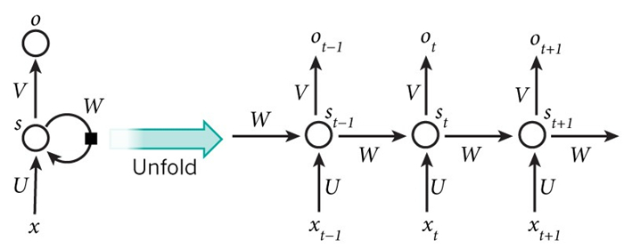

# 神经网络

 

#### RNN简述

- RNN的层级展开图如下所示
  

- 通常，其公式表达为
  $$
  \begin{aligned}
  h_t&=Ux_t+Ws_{t-1} \\
  s_t&=f(h_t) \\
  o_t&=g(Vs_t),
  \end{aligned}
  $$
  其中，$f$可以是`Tanh`、`ReLU`、`Sigmoid`等激活函数，$g$通常是`Softmax`。在每一个时刻，**权重矩阵都是共享的**。

> [!TIP|label:为什么需要RNN]
> 常规的神经网络模型只能单独地去处理一个个的输入，前一个输入和后一个输入是完全没有关系的。但是，某些任务需要能够更好的处理序列的信息，即前面的输入和后面的输入是有关系的。为了能够更好的处理序列的信息，RNN就诞生了。

 

#### RNN常见的设计模式

- 标准Elman RNN：每个时间步都有输出，且隐藏单元之间有循环连接。
- 忽视中间输出：隐藏单元之间有循环连接，但只有最后一个时间步有输出。
- Jordan RNN：每个时间步都有输出，但是隐藏单元之间没有循环连接，只有**当前时刻的输出**到**下个时刻的隐藏单元**之间有循环连接。模型表示能力更弱，但可以并行化训练。

 

#### RNN为什么会出现梯度消失

RNN梯度消失是因为激活函数`Tanh`函数的导数在`[0, 1]`（`Sigmoid`函数的导数在`[0, 0.25]`），反向传播时更新前面时刻的参数时，当参数`W`初始化为`小于1`的数，则多个导数和`W`的相乘（小于1的数连乘），**将导致求得的偏导极小**，从而导致梯度消失。

> [!TIP|label:如何解决RNN的梯度消失问题]
> 1. **选用`ReLU`（`LeakReLU`、`eLU`）激活函数。**`ReLU`函数的左侧导数为`0`，右侧导数恒为`1`，这就避免了梯度消失的发生。此外，`ReLU`计算方便、计算速度快，可以加速网络的训练。缺点一是恒为`1`的导数容易导致梯度爆炸，但设定合适的阈值可以解决这个问题。缺点二是由于负数部分恒为`0`，会导致一些神经元无法激活（可通过设置小学习率部分解决）；
> 2. **加入Batch Normalization层**，其优点包括可加速收敛、提升训练稳定性、控制过拟合等。Batch Normalization通过对每一层的输出规范为均值和方差一致，消除了权重矩阵带来的放大缩小的影响；
> 3. **设计残差结构**；
> 4. **引入门控机制**，换用LSTM、GRU。

 

#### RNN为什么会出现梯度爆炸

RNN梯度爆炸是因为当参数初始化为足够大，使得`Tanh`函数的导数乘以`W`依然大于`1`（大于1的数连乘），则将导致**偏导极大**，从而导致梯度爆炸。

> [!TIP|label:如何解决RNN的梯度爆炸问题]
> 1. **梯度剪切**的思想是设置一个梯度剪切阈值，然后更新梯度的时候，如果梯度超过这个阈值，那么就将其强制限制在这个范围之内，这可以防止梯度爆炸；
> 2. **采用权重正则化**（`L1/L2`正则），通过对网络权重做正则限制过拟合，例如$\alpha{||W||}^2$。如果发生梯度爆炸，权值的范数就会变的非常大，通过正则化项，可以部分限制梯度爆炸的发生。

 

> [!NOTE|label:参考资料]
> [RNN梯度消失和爆炸](https://blog.csdn.net/jizhidexiaoming/article/details/81743584) 
>